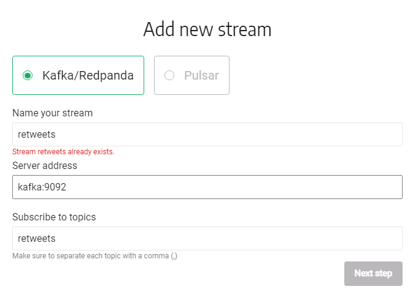
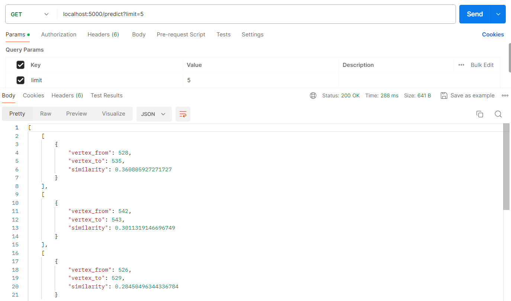

<h1 align="center">
 🔍 Twitter Network Analytics Demo 🔍
</h1>

<p align="center">
  <a href="https://github.com/g-despot/twitter-network-analysis/blob/main/LICENSE">
    
  </a>
  <a href="https://github.com/g-despot/twitter-network-analysis">
    
  </a>
</p>

<p align="center">
  <a href="https://twitter.com/intent/follow?screen_name=memgraphdb">
    
  </a>
  <a href="https://memgr.ph/join-discord">
    
  </a>
</p>

A web application with backend in Flask and frontend in React and D3.js that
uses Memgraph to ingest real-time data scraped from Twitter. Data is streamed
via [Apache Kafka](https://kafka.apache.org/) or [Apache
Pulsar](https://pulsar.apache.org/), and stream processing is performed with
Memgraph.

## App architecture

<p align="left">
  
</p>

## Data model

<p align="left">
  
</p>

## Prerequisites

You will need:

- [Docker](https://docs.docker.com/get-docker/)
- [Docker Compose](https://docs.docker.com/compose/install/) (included with
  Docker Desktop on Windows and macOS)

## Running the app

### Stage 1 - Docker Compose

**1.** Remove possibly running containers:

```
docker-compose rm -fs
```

**2.** Build all the needed images:

```
docker-compose build
```

**3.** Build and Start the services:

```
docker-compose up --build
```

**4.** Start the services

```
docker-compose up
```

### Stage 2 - Memgraph Configuration

**1.** Install MemgraphLab
https://memgraph.com/download

**2.** Import .cypherl file in `/memgraph`

Four triggers should be setup now: `labelrankt_trigger`, `node2vec_trigger`, `pagerank_trigger`, `created_trigger`

**3.** Create and Start Kafka Stream

Remember to add transformation `twitter` afterwards and start the stream. Nodes and Relationships value should then be updated in real-time.



### Stage 3 - Run the App

**4.** Start the application

The React application will be running on `http://localhost:3000`. Notice that if you restart any services, you should also restart the web app to view the changes.

**5.** Run Prediction API

Import the file attached via Postman in `/backend`



## The visualization

**Dynamic Community detection**:

<p align="left">
  
</p>


**Dynamic PageRank**:


